# Phase 3 Flow (No Redis)

Simple view of everything we built in Phase 3.
Every request goes to PostgreSQL. There is no cache, no lock and no Redis yet.

---

## 1. The big picture

Every request follows the same path: Controller, then Service, then Repository, then the database.

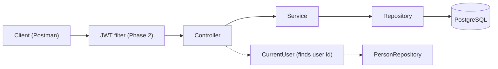

| Layer | Job |
|---|---|
| Controller | Takes the request, calls the service, returns the response |
| Service | The real logic (checks, rules, saving) |
| Repository | Talks to the database |
| CurrentUser | Reads the username from the token and finds the user id |

---

## 2. The three tables

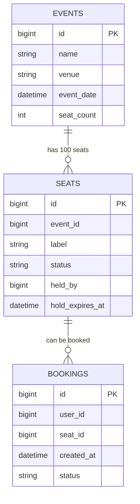

`event_id`, `seat_id` and `user_id` are plain numbers. There are no foreign keys, to keep it simple.

---

## 3. Seat status: how a seat changes

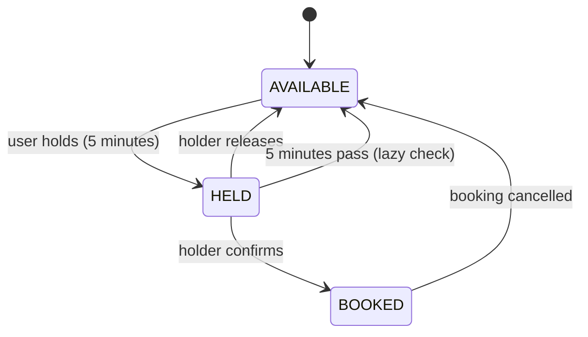

"Lazy check" means nobody cleans up in the background. The hold is only seen as expired when someone reads or touches that seat.

---

## 4. Admin creates an event (3.3 and 3.4)

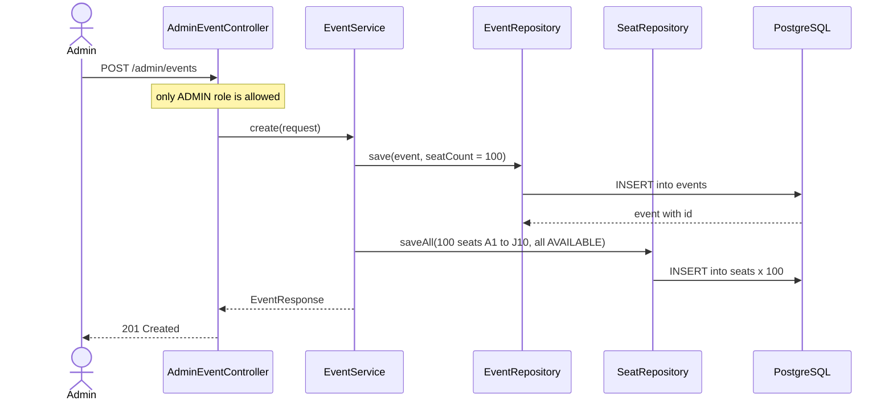

If a normal user calls this, Spring Security stops it with 403 before the controller code runs.

---

## 5. Update and delete an event (3.3)

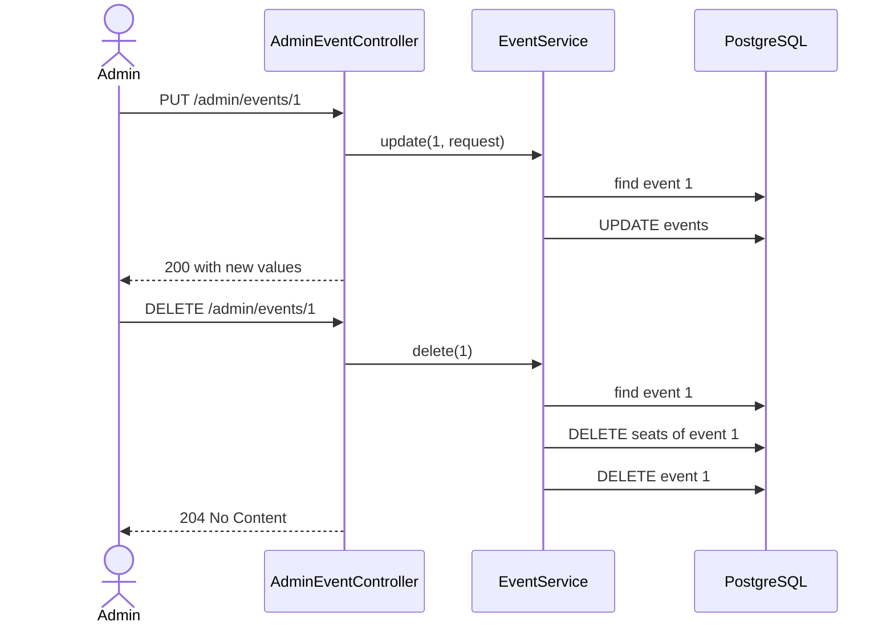

If the event does not exist, the service throws 404.

---

## 6. Read events (3.5)

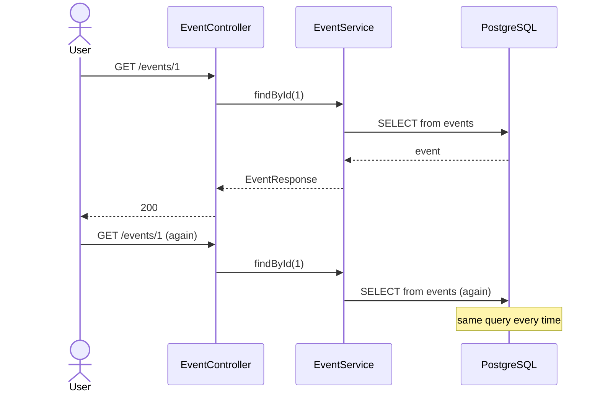

Every read hits the database, even when the data did not change. This is the problem Phase 4 solves with Redis cache.

---

## 7. Seat map with lazy expiry (3.6)

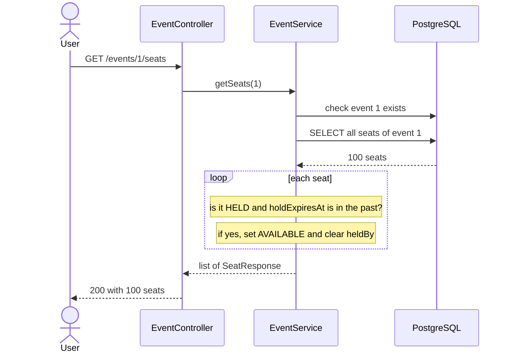

This GET can also write to the database (when it clears an expired hold). That is a weak point we fix in Phase 8.

---

## 8. How the app knows who the user is

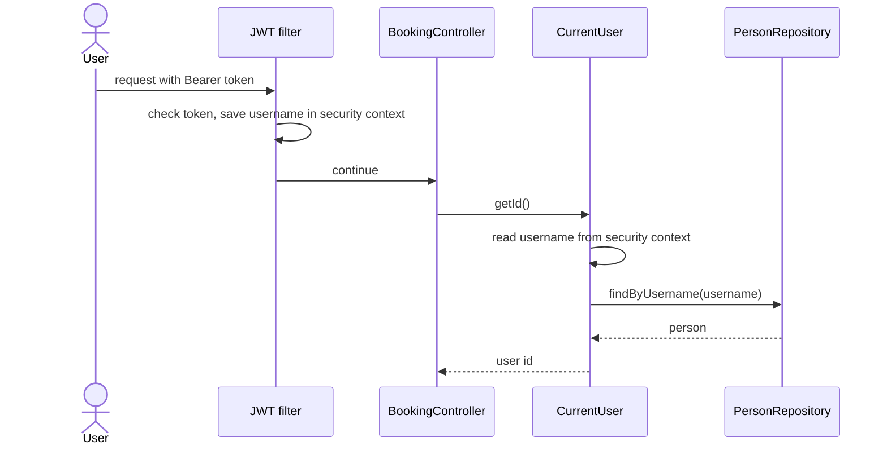

---

## 9. Hold a seat (3.8)

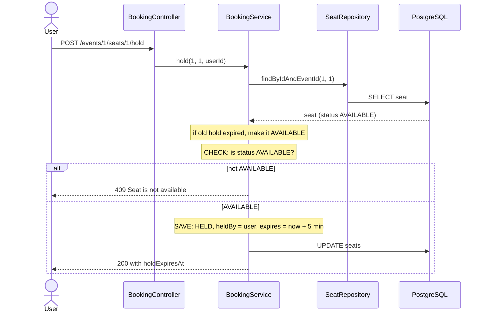

The rule is "check first, then save". These are two separate steps, and nothing stops another request from sneaking in between them (see section 13).

---

## 10. Confirm a booking (3.9)

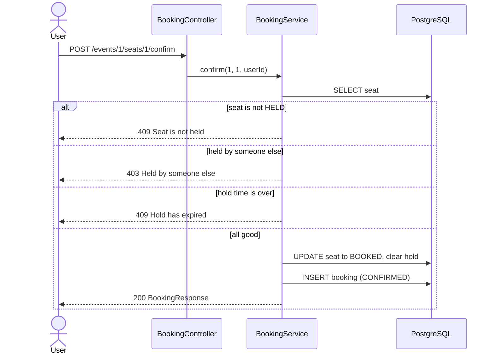

Payment is fake. Calling confirm means "payment done".

---

## 11. Release a hold (3.10)

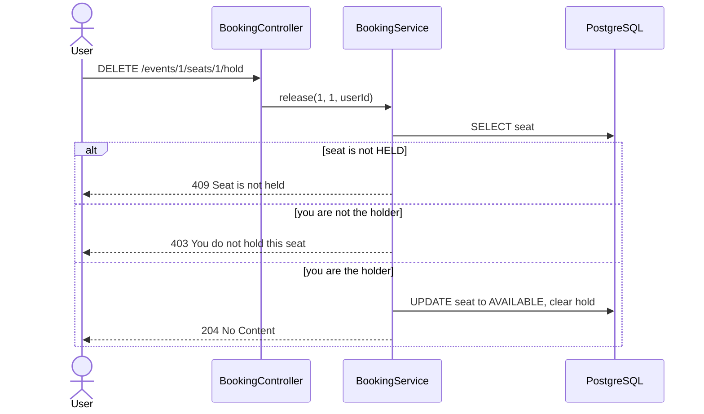

---

## 12. Cancel a booking and see my bookings (3.10)

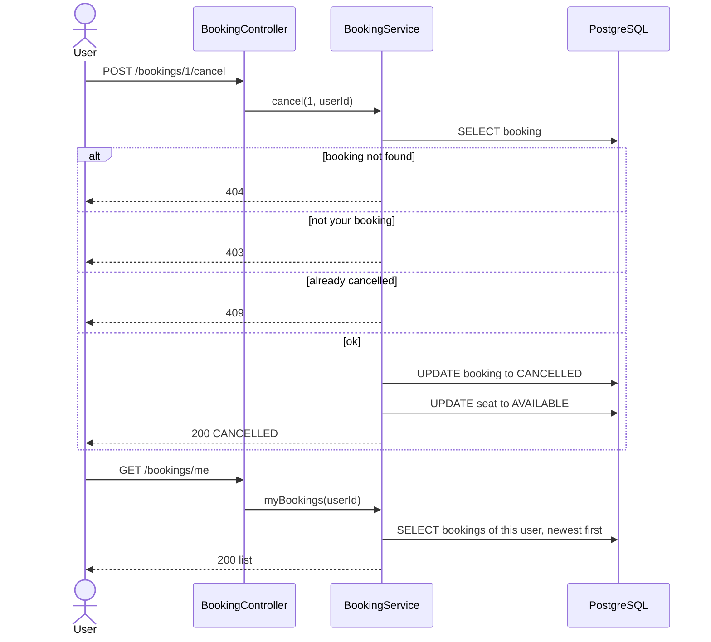

---

## 13. The bug we keep on purpose: two users hold the same seat

Both users hit hold on seat 5 at almost the same time.

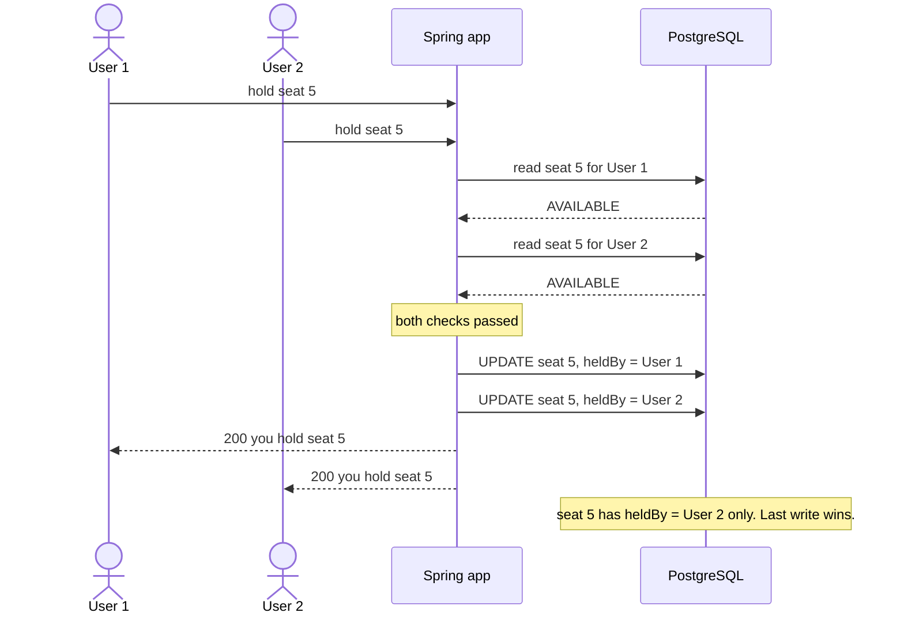

**Result:** both users are told they hold the seat, but only User 2 really does. This is a race condition.

Why it happens:
- "Check then save" is not one atomic step.
- There is no `@Version` and no lock.
- `synchronized` would not help either, because with two app instances each has its own lock.

**Fixed in:** Phase 7 (distributed lock) and Phase 8 (Redis `SET NX EX`).

---

## 14. What we have and what is coming

| Problem in Phase 3 | Solved in |
|---|---|
| Every read hits the database | Phase 4 (cache) |
| Cache can show old seat status | Phase 5 (invalidation) |
| Two users can hold the same seat | Phase 7 (lock) and Phase 8 (`SET NX EX`) |
| Holds expire only when someone reads (lazy) | Phase 8 (Redis TTL) |
| Logout blacklist is in memory | Phase 10 (Redis) |
